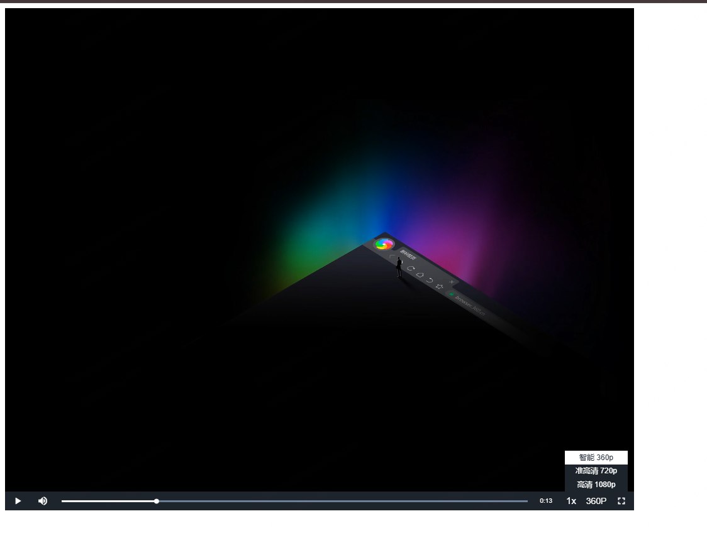

# videojs-plugin-switch-resolution

使用视频配置源切换分辨率的 videojs 插件。

## 特性

- 支持多分辨率视频源切换
- 切换时保持播放进度
- 自定义按钮文本

## 使用方法

源码:

`src/plugin.js`
`src/plugin.scss`

## 配置选项

### videoSources
- 类型: `Array`
- 必填: 是
- 说明: 视频源配置数组

| 属性 | 说明 |
| --- | --- |
| `src` | 视频地址 |
| `type` | 视频类型 |
| `label` | 清晰度文本显示 |
| `resolution` | 分辨率数值(如: '360', '720', '1080') |

### controlText
- 类型: `String`
- 必填: 否
- 默认值: 'Resolution'
- 说明: 控制按钮的提示文本

## 注意事项

1. 依赖 video.js@^8
2. 切换分辨率时会保持当前播放进度和播放状态
3. 分辨率按钮默认显示在全屏按钮前

## 查看效果:

命令: `npm run dev`

## License

MIT
